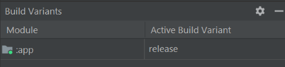

# NUMAD23Sp_Team26

## Development
1. Copy `apikey.blank.properties` to the same directory and rename `apikey.properties`
2. Enter the API secrets in `apikey.properties` file
3. Build project

## Release Build
1. Add below variables to user environment variables.

    | Variable                        |
    | ------------------------------- |
    | android_team26_store_path       |
    | android_team26_store_password   |
    | android_team26_key_password     |

2. Select `Build` > `Select Build Variant...` > `release`\

3. Select `Build` > `Build Bundle(s) / APK(s)` > `Build APK(s)` in Android Studio\

